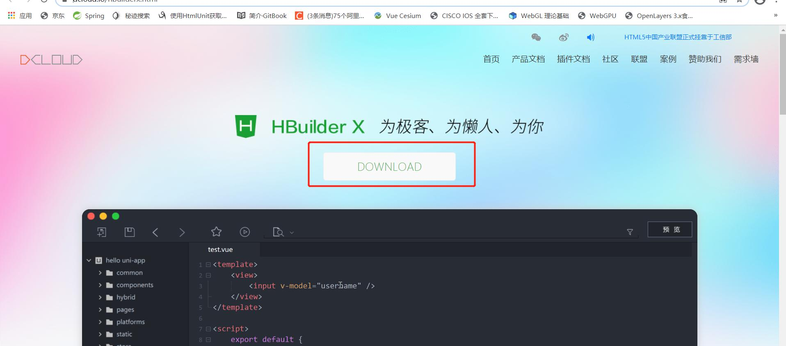
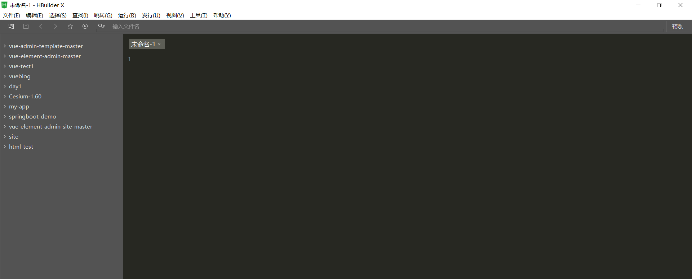
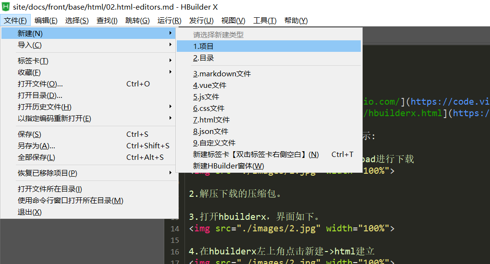
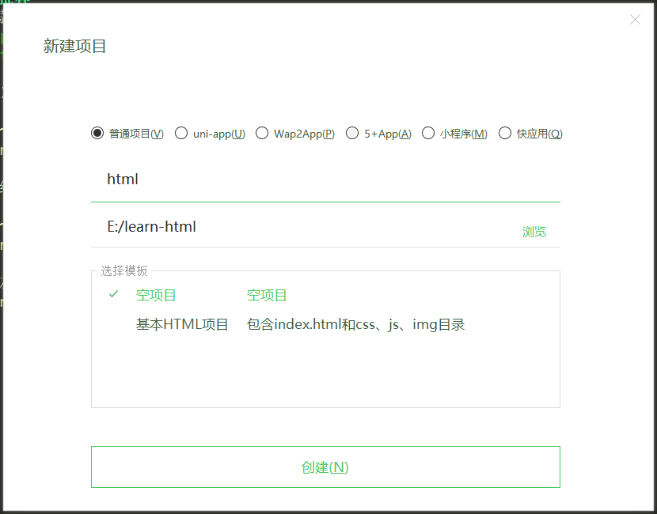
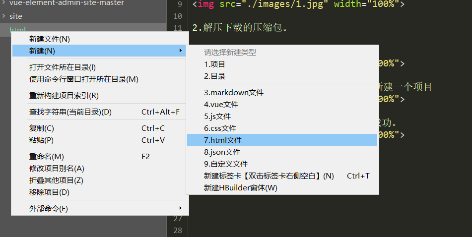
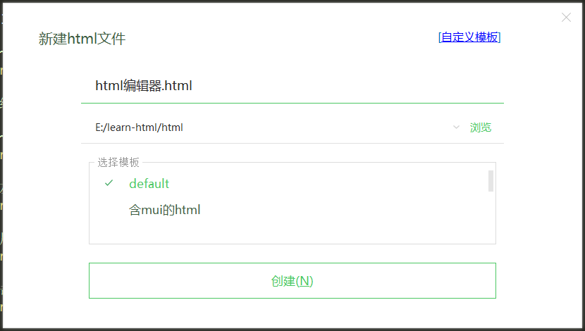
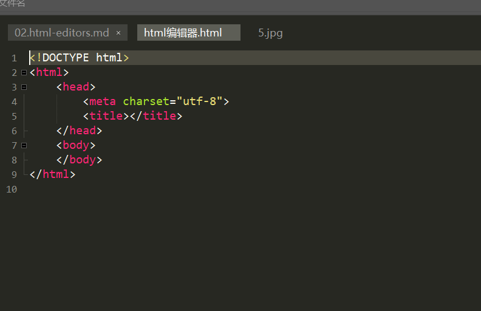
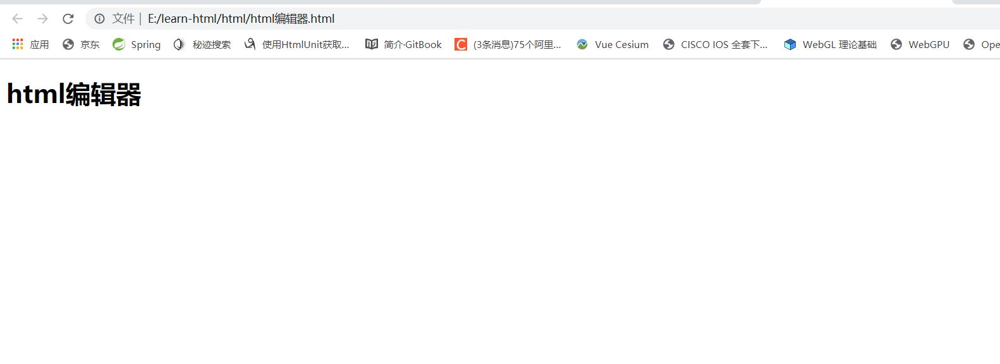

# HTML 编辑器
这里推荐一下几款编辑器：
* vscode [https://code.visualstudio.com/](https://code.visualstudio.com/)
* hbuilder [https://www.dcloud.io/hbuilderx.html](https://www.dcloud.io/hbuilderx.html)

这里我们以hbuilderx为开发工具进行演示:

1.进入hbuilderx下载页面，点击download进行下载


2.解压下载的压缩包。

3.打开hbuilderx，界面如下。


4.在hbuilderx左上角点击新建->项目  新建一个项目


5.填入新建项目属性，点击创建新建项目成功。


6.右键项目，点击新建->html文件


7.点击创建，html文件创建成功


8.创建成功的html已经有了基础部分的代码。


9.我们编辑这个html文件

最终代码
``` html
<!DOCTYPE html>
<html>
	<head>
		<meta charset="utf-8">
		<title></title>
	</head>
	<body>
		<h1>html编辑器</h1>
	</body>
</html>
```

10.右键【html编辑器.html】这个文件，选择  打开文件所在目录，用浏览器打开该html文件，可以看到如下结果



至此，我们第一个html页面的创建演示完成


